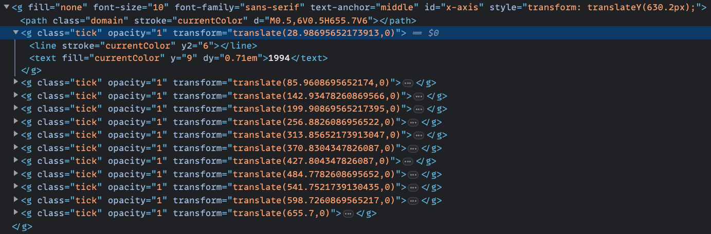
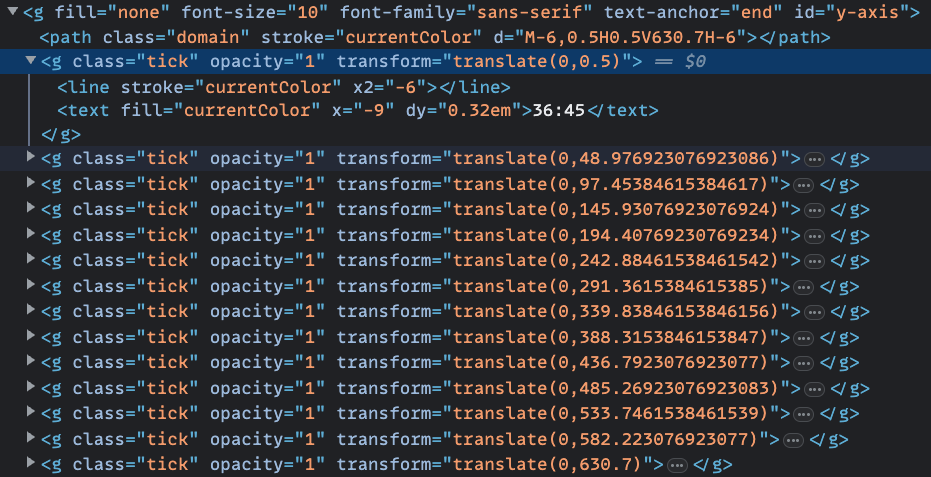

# 04. Refactoring The Chart Peripherals

## "Reverse-engineering" D3 Axes

In the first version of the project, we used D3's built-in axis generator functions to display our axis lines:

```js
const xAxisGenerator = d3.axisBottom().scale(xScale).tickFormat(d3.format(""));
const xAxis = bounds
	.append("g")
	.call(xAxisGenerator)
	.attr("id", "x-axis")
	.style("transform", `translateY(${dimensions.boundedHeight}px)`);
```

While we _can_ take the easy way out and use these same exis generator functions and let D3 handle rendering our axis lines, it's still a much better solution to let our framework of choice handle all of the rendering for us, including the axis lines for our chart.

Now, how would we imitate the axis lines generated by D3? We can reopen the previous version and take a look at the generated HTML output using our DevTools:





In a nutshell, D3's axis generator functions generate a bunch of SVG elements (`<g>`, `<line>`, `<text>`, etc) from the scale functions we passed in previously. Our scale functions can actually provide an array of axis ticks which the axis generator can then loop over to generate the required SVG elements.

What this means is, we can essentially replicate this rendering logic and apply it using our framework of choice! First, we can directly generate axis ticks from our scale functions:

```ts
const xTicks = xScale.ticks();
const yTicks = yScale.ticks();
```

Now that we have the arrays of tick values for each axis, we can use them to render our own axis lines! From here on out, it's simply a matter of looping over these arrays to generate some SVG elements. Try imitating the HTML outputs from the screenshots above!

<details>
	<summary>Solution: React</summary>

```tsx
{/* Step 6. Draw peripherals */}
<g
	id="x-axis"
	fontSize={10}
	fontFamily="sans-serif"
	textAnchor="middle"
	transform={`translate(0, ${dimensions.boundedHeight})`}
>
	<line stroke="currentColor" x2={dimensions.boundedWidth} />
	{xTicks.map((tick, i) => (
		<g
			key={i}
			className="tick"
			transform={`translate(${xScale(tick)}, 0)`}
		>
			<line stroke="currentColor" y2={6} />
			<text fill="currentColor" y={9} dy="0.71em">
				{tick}
			</text>
		</g>
	))}
</g>
<g id="y-axis" fontSize={10} fontFamily="sans-serif" textAnchor="end">
	<line stroke="currentColor" y2={dimensions.boundedHeight} />
	{yTicks.map((tick, i) => (
		<g
			key={i}
			className="tick"
			transform={`translate(0, ${yScale(tick)})`}
		>
			<line stroke="currentColor" x2={-6} />
			<text fill="currentColor" x={-9} dy="0.32em">
				{d3.timeFormat("%M:%S")(tick)}
			</text>
		</g>
	))}
	<text
		x={0}
		y={-dimensions.margin.left + 25}
		transform="rotate(-90)"
		fill="var(--color-text)"
		style={{
			fontSize: "1.6em",
			fontWeight: "bold",
			textAnchor: "end",
		}}
	>
		Time in Minutes
	</text>
</g>
```

</details>

<details>
	<summary>Solution: Svelte</summary>

```svelte
<!-- Step 6. Draw peripherals -->
<g
	id="x-axis"
	font-size={10}
	font-family="sans-serif"
	text-anchor="middle"
	transform={`translate(0, ${dimensions.boundedHeight})`}
>
	<line stroke="currentColor" x2={dimensions.boundedWidth} />
	{#each xTicks as tick}
		<g
			class="tick"
			transform={`translate(${xScale(tick)}, 0)`}
		>
			<line stroke="currentColor" y2={6} />
			<text fill="currentColor" y={9} dy="0.71em">
				{tick}
			</text>
		</g>
	{/each}
</g>
<g id="y-axis" font-size={10} font-family="sans-serif" text-anchor="end">
	<line stroke="currentColor" y2={dimensions.boundedHeight} />
	{#each yTicks as tick}
		<g
			class="tick"
			transform={`translate(0, ${yScale(tick)})`}
		>
			<line stroke="currentColor" x2={-6} />
			<text fill="currentColor" x={-9} dy="0.32em">
				{d3.timeFormat("%M:%S")(tick)}
			</text>
		</g>
	{/each}
	<text
		x={0}
		y={-dimensions.margin.left + 25}
		transform="rotate(-90)"
		fill="var(--color-text)"
		style="font-size: 1.6em; font-weight: bold; text-anchor: end;"
	>
		Time in Minutes
	</text>
</g>
```

</details>

<details>
	<summary>Solution: Vue</summary>

```vue
<template>
	<!-- Step 6. Draw peripherals -->
	<g
		id="x-axis"
		font-size="10"
		font-family="sans-serif"
		text-anchor="middle"
		:transform="`translate(0, ${dimensions.boundedHeight})`"
	>
		<line stroke="currentColor" :x2="dimensions.boundedWidth" />
		<g
			v-for="tick in xTicks"
			class="tick"
			:transform="`translate(${xScale(tick)}, 0)`"
		>
			<line stroke="currentColor" y2="6" />
			<text fill="currentColor" y="9" dy="0.71em">{{ tick }}</text>
		</g>
	</g>
	<g id="y-axis" font-size="10" font-family="sans-serif" text-anchor="end">
		<line stroke="currentColor" :y2="dimensions.boundedHeight" />
		<g
			v-for="tick in yTicks"
			class="tick"
			:transform="`translate(0, ${yScale(tick)})`"
		>
			<line stroke="currentColor" x2="-6" />
			<text fill="currentColor" x="-9" dy="0.32em">
				{{ d3.timeFormat("%M:%S")(tick) }}
			</text>
		</g>
		<text
			x="0"
			:y="-dimensions.margin.left + 25"
			transform="rotate(-90)"
			fill="var(--color-text)"
			style="font-size: 1.6em; font-weight: bold; text-anchor: end"
		>
			Time in Minutes
		</text>
	</g>
</template>
```

</details>

## Adding the Titles and Legends

Using a framework, it's much easier to add more peripherals to our chart! Lets finish off the rest of Step 6 by adding the legends and titles from the previous version. We'll simply use the same elements and attributes as before, but this time we can directly type out the SVG elements ourselves.

**Hint**

- If you're still not sure which elements to display or where to display them, you can always reopen the previous version and check the HTML output in the DevTools!

<details>
	<summary>Solution: React</summary>

Legends:

```tsx
{
	/* Insert this below the x and y axes */
}
<g
	id="legend"
	style={{
		transform: `translate(${dimensions.boundedWidth}px, ${
			dimensions.boundedHeight / 2 - 50
		}px)`,
	}}
>
	<text x={-35} className="legend-text">
		No doping allegations
	</text>
	<rect x={-25} y={-12.5} width={20} height={20} className="legend-no-doping" />
	<text x={-35} y={25} className="legend-text">
		Riders with doping allegations
	</text>
	<rect x={-25} y={12.5} width={20} height={20} className="legend-doping" />
</g>;
```

Titles:

```tsx
{
	/* Insert this below the wrapper <g> element */
}
<g id="title" transform={`translate(${dimensions.width / 2}, 35)`}>
	<text
		style={{
			fill: "var(--color-text)",
			fontSize: "1.6em",
			fontWeight: "bold",
			textAnchor: "middle",
		}}
	>
		Doping in Professional Bicycle Racing
	</text>
	<text
		y={25}
		style={{
			fill: "var(--color-text)",
			fontSize: "1.4em",
			fontWeight: "medium",
			textAnchor: "middle",
		}}
	>
		35 Fastest times up Alpe d'Huez
	</text>
</g>;
```

</details>

<details>
	<summary>Solution: Svelte</summary>

Legends:

```svelte
<!-- Insert this below the x and y axes -->
<g
	id="legend"
	style="transform: translate({dimensions.boundedWidth}px, {dimensions.boundedHeight / 2 - 50}px)"
>
	<text x={-35} class="legend-text">
		No doping allegations
	</text>
	<rect
		x={-25}
		y={-12.5}
		width={20}
		height={20}
		class="legend-no-doping"
	/>
	<text x={-35} y={25} class="legend-text">
		Riders with doping allegations
	</text>
	<rect
		x={-25}
		y={12.5}
		width={20}
		height={20}
		class="legend-doping"
	/>
</g>
```

Titles:

```svelte
<!-- Insert this below the wrapper <g> element -->
<g id="title" transform={`translate(${dimensions.width / 2}, 35)`}>
	<text
		style="fill: var(--color-text); font-size: 1.6em; font-weight: bold; text-anchor: middle"
	>
		Doping in Professional Bicycle Racing
	</text>
	<text
		y={25}
		style="fill: var(--color-text); font-size: 1.4em; font-weight: medium; text-anchor: middle"
	>
		35 Fastest times up Alpe d'Huez
	</text>
</g>
```

</details>

<details>
	<summary>Solution: Vue</summary>

Legends:

```vue
<template>
	<!-- Insert this below the x and y axes -->
	<g
		id="legend"
		:style="`transform: translate(${dimensions.boundedWidth}px, ${
			dimensions.boundedHeight / 2 - 50
		}px)`"
	>
		<text x="-35" class="legend-text">No doping allegations</text>
		<rect x="-25" y="-12.5" width="20" height="20" class="legend-no-doping" />
		<text x="-35" y="25" class="legend-text">
			Riders with doping allegations
		</text>
		<rect x="-25" y="12.5" width="20" height="20" class="legend-doping" />
	</g>
</template>
```

Titles:

```vue
<template>
	<!-- Insert this below the wrapper <g> element -->
	<g id="title" :transform="`translate(${dimensions.width / 2}, 35)`">
		<text
			style="
				fill: var(--color-text);
				font-size: 1.6em;
				font-weight: bold;
				text-anchor: middle;
			"
		>
			Doping in Professional Bicycle Racing
		</text>
		<text
			y="25"
			style="
				fill: var(--color-text);
				font-size: 1.4em;
				font-weight: medium;
				text-anchor: middle;
			"
		>
			35 Fastest times up Alpe d'Huez
		</text>
	</g>
</template>
```

</details>
